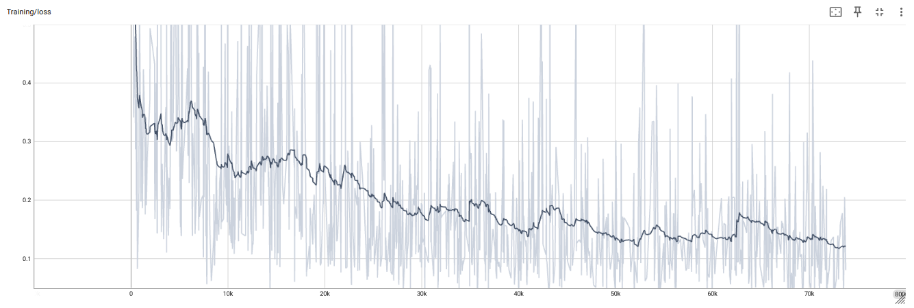
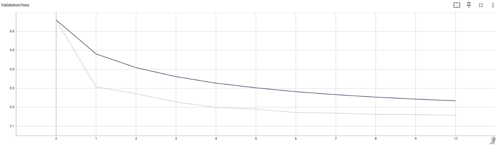
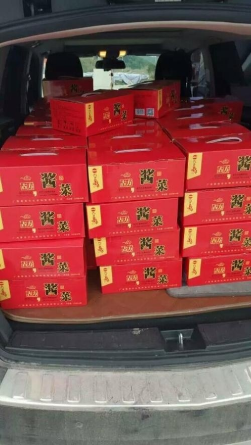
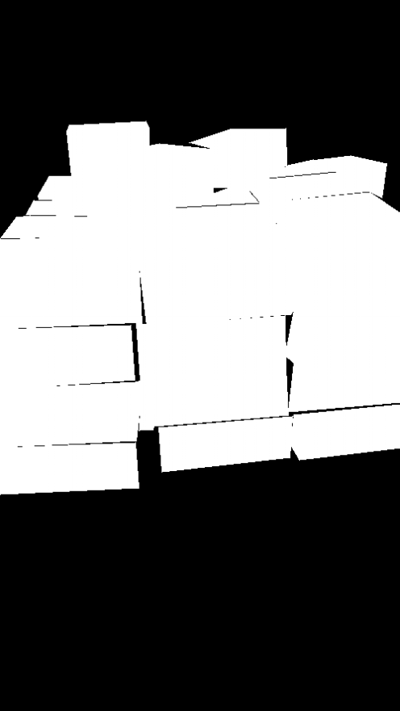
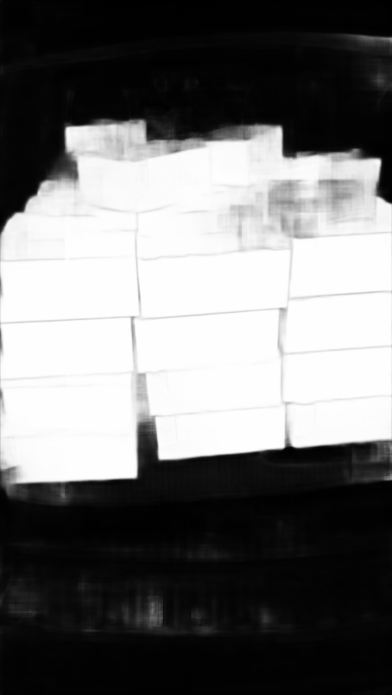
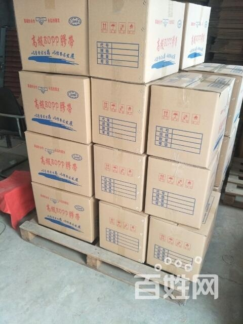
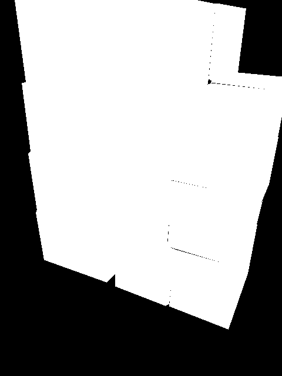
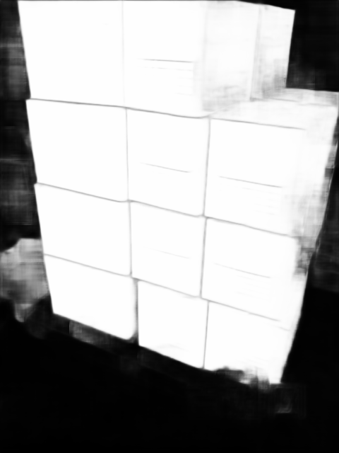
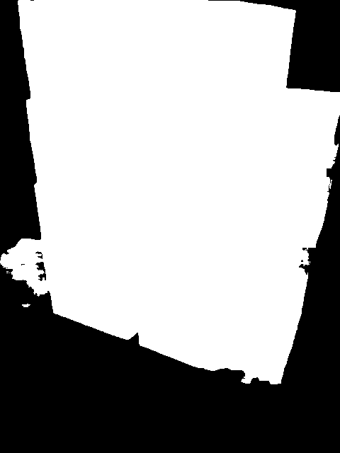

# Setup
```bash
conda env create -f environment.yml
conda activate box_segmentation
# Install torch
pip install torch==2.7.0 torchvision --index-url https://download.pytorch.org/whl/cu118
```

# Goal
Our goal is to train a simple box segmentation model. For each pixel of a given image, it will estimate whether it is part of a box or not.

# Dataset
We use the [OSCD dataset](https://github.com/yancie-yjr/scd.github.io) that provides images with boxes and corresponding segmentation labels.

# Approach
1. In order to perform the training download the OSCD dataset into ./oscd
2. We train a simple UNet-style network for 10 epochs on the train split of OSCD.
3. Since we only want to distinguish between image areas containing boxes and areas not containing boxes, we use a binary cross-entropy loss. To use this loss, we prepare for each training sample a ground truth segmentation mask with values being set to 1 for pixels that are labeled as box according to the ground truth and zeros otherwise.
4. Augmentations could be used to increase the variance of our rather small training dataset (7380 images). An option for that is available in the train script. However, with this current setup it does not improve the results. Possibly, because the train, validation, and evaluation split samples are sufficiently similar, such that overfitting to some degree is okay.  
5. We use an Adam optimizer with learning rate of 0.0001.
6. For simplicity, we train with a batch size of 1. For further improvements, could bring all training images to the same size, e.g. by cropping, to train with larger batches.
7. Validation is performed on the first half of the validation split of the OSCD dataset. The remaining samples are used for evaluation, because the dataset is lacking a separate split for that.
8. We keep the checkpoint with lowest validation error, as well as the latest checkpoint in case we want to resume a training later.

# Quantitative results
Tensorboard logs can be found in the folder ./example_training. <br>
We obtain best validation performance after 10 epochs. After about 7 epochs the training loss starts to stagnate at about 0.13:<br>
<br>
and the validation loss at 0.16.<br>
<br>
The evaluation loss is 0.18.

# Qualitative results
Example input image A: <br>
<br>
Ground truth segmentation: <br>
<br>
Predicted segmentation: <br>
<br>
Predicted segmentation binarized with threshold 0.5: <br>
<br><br>
Example input image B: <br>
<br>
Ground truth segmentation: <br>
<br>
Predicted segmentation: <br>
<br>
Predicted segmentation binarized with threshold 0.5: <br>
<br>